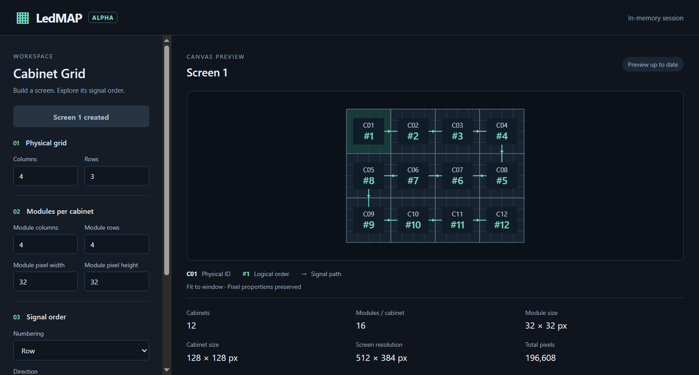

# LEDMAP-ALPHA-UI-001 — отчёт реализации

Дата локальной проверки: 2026-09-24. Утверждённый контракт: commit `3bbd279` (`docs: define early alpha ui`), ADR-017 Accepted.

Реализовано: Electron → Create Screen → один Screen/Grid → настройки геометрии и ordering → существующий Cabinet Engine → Canvas. Состояние in-memory; StartCorner фиксирован в Top Left. Физические ID и логические номера отображаются раздельно. Renderer получает порядок через `cabinetOrder()` и `cabinetIndex()`, проверяет generalized pixel layout через `decomposeCabinetPixel()`.

`packages/core` и его тесты не изменены. Hardware, Mapping Engine, save/load, экспорт, vendor formats, новые режимы математики и UI frameworks не добавлены. Привилегированный preload/IPC не требуется; предупреждение electron-vite `preload config is missing` ожидаемо.

| Проверка | Результат |
|---|---|
| `npm test` | 252/252: 225 прежних core-тестов + 27 тестов адаптера app |
| `npm run typecheck` | Оба пакета проходят |
| `npm run lint` | Проходит |
| `npm run build` | Создаёт Electron main и renderer в `packages/app/out` |
| `npm run dev` | Electron запускается, renderer загружается, Vite подключается |
| `npm run test:smoke` | Настоящее Electron-окно, все сценарии ниже проходят |
| Граница core/app | Изменений в `packages/core` нет; импорт renderer — через public `@ledmap/core` |

Smoke проверяет создание Screen/Grid; все восемь комбинаций Row/Column, допустимого Direction и Snake; реальные вызовы Canvas `fillText` для физических ID и логических номеров; независимые ожидаемые номера REF-001 и остальных режимов. Начальный результат: 12 кабинетов, 512×384 px, 196 608 px.

Дополнительно проверены layout 3×2 по 5×7 px (кабинет 15×14, Screen 60×42, 2520 px), пустой ввод, ноль, отрицательные/дробные/небезопасные числа, переполнение layout, лимиты 1024 кабинета и 65 536 модулей. При ошибке сохраняется предыдущий preview; сообщение видно над Canvas; исправление возобновляет обновление.

Сетки 1×1, 1×5 и 5×1 проверены во всех восьми режимах. Проверены resize до 960×760, переключение DPR=2 без изменения CSS-размеров viewport, скрытие мелких деталей на сетке 32×32. Canvas отслеживает изменение DPR отдельно от resize, чтобы корректно перерисовываться при смене масштаба монитора. Ошибок renderer в smoke не зарегистрировано. Исправлена особенность Windows-запуска Playwright: путь к приложению нормализуется без завершающего разделителя.

Снимки начальной, прямоугольной, ошибочной и уменьшенной конфигураций осмотрены визуально. Начальный preview сохранён в репозитории:

Остальные снимки доступны локально в `packages/app/out/smoke` и пересоздаются командой `npm run test:smoke` после сборки. Все результаты в этом отчёте локальные; GitHub Actions не настроены.

Запуск и ограничения: [README](../README.md). Installer и сохранение проекта остаются будущими этапами.
