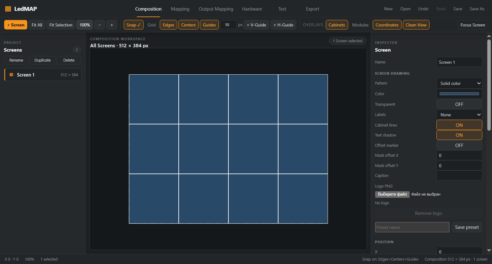

# Обводка кабинетов — исправление 2026-10-06

Пользователь задал внутреннюю обводку 1 px с каждой стороны кабинета и общий стык 2 px без тени; уточнил, что толщина на экране должна сохраняться при любом zoom. [Контракт](../specs/LEDMAP-CABINET-BORDER-CORRECTIVE-001.md). База: `e735774c92d2e0648b1a783f3cd7a68ca00570fb`, выделенная ветка `feat/cabinet-inset-borders`; preflight выполнен до кода.

## Изменение

Прежний chart рисовал только верхнюю и левую полосы: стык был 1 px в исходном изображении и уменьшался вместе с zoom. Редактор дополнительно накладывал stroke по центру границы. Теперь общий chart frame содержит примитив полной внутренней обводки. Composition, Test, Live Output и PNG используют один Canvas renderer; Cabinet overlay использует ту же функцию.

Renderer вычисляет стороны из исходных координат кабинета, затем применяет camera / DPR и округляет в пиксели backing buffer. Совпадающие стороны соседей округляются одинаково. Обводка 1 px проходит внутри каждой стороны, поэтому стык занимает 2 px. Shadow/blur принудительно отключены только для обводки; настройка тени текста сохраняется. Цвета редакторского overlay и drawing, Cabinet lines OFF и dashed pending resize сохранены.

PNG: тот же внутренний контур в actual pixels. SVG: четыре внутренние полосы по 1 px в исходных координатах, без фильтра тени. Core, геометрия проекта, назначения, Cabinet numbering и формат `.ledmap` не изменены. Новых зависимостей, внешнего кода, assets или vendor data нет; B.L.I.N.K copied = NO.

## Проверки

| Gate | Результат |
|---|---|
| Полная unit-регрессия | 113 файлов / 1770 тестов PASS, REF-001–004 |
| Typecheck / lint / build | PASS |
| Штатный Windows Electron smoke | PASS |
| Пиксельный smoke | 47 / 50 / 100 / 200%, DPR 1 / 2, editor / Clean View: 16 комбинаций, вертикальный и горизонтальный стык ровно 2 px |
| PNG | Ровно два непрозрачных пикселя на стыке, 1 px на наружной стороне, соседние пиксели сохраняют цвет заливки |
| SVG | Покрытие обеих сторон стыка, отсутствие покрытия соседнего внутреннего пикселя и фильтра тени на обводке |
| UI/session | Cabinet lines OFF удаляет контур; zoom/DPR/overlay не меняют project/revision; mask regression сохранён |

Новый тест сначала требовал точного равенства DPR целому числу. Electron/Chromium возвращает `1.0000000149` / `2.0000000298`; условие ожидания теперь допускает только числовую погрешность до 1e-6. После эмуляции выполняется перерисовка через кнопку 100%. Проверки RGBA пикселей остаются точными. Редактор сохраняет прежний серый цвет overlay, Clean View — цвет drawing; оба состояния проверяются отдельно.

Среда: Windows 10 Pro 19045 x64, i7 M620, GT 330M, 3.86 GiB RAM, Node 24.19.0, Electron 44.4.5 / embedded Node 24.21.0. Production electron-vite: main 233.62 kB без изменений, initial renderer 693.45 → 693.57 kB (+0.12 kB). Отдельный timing benchmark для этого корректирующего этапа не выполнялся.

Снимок из тестового fixture визуально проверен. Оригинальный пользовательский worktree и открытый несохранённый проект сохранены; новое окно запущено с отдельной проверенной копией recovery snapshot из трёх экранов. Пользовательский snapshot не включён в Git.

## Ограничения и rollback

Если кабинет отображается размером менее двух пикселей, противоположные стороны перекрываются внутри его видимой площади. Обводка привязана к пикселям Canvas, а не к CSS width при нестандартном DPR. Масштаб SVG в стороннем viewer управляется этим viewer. Тени текстовых подписей и отдельные selection / module / guide overlays сохраняют собственные настройки.

Rollback: revert исправления и rebuild; миграция проектов не требуется.
