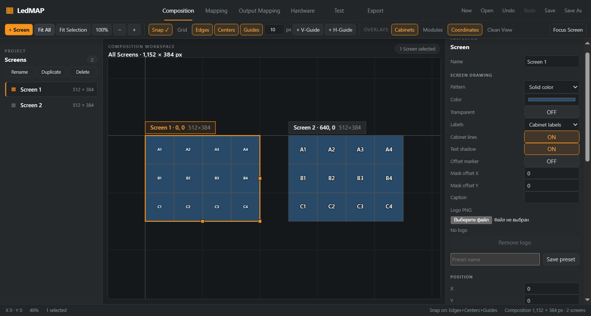

# Исправление дублирующихся подписей кабинетов

Дата проверки: 2026-10-07. Ветка: `feat/cabinet-label-overlap`, отдельный worktree от актуального `origin/master` (`7dc3acb90f990ec75eb6d3025dedb48d3720d066`). Обязательный preflight пройден.

## Причина и изменение

Screen Drawing рисовал крупную подпись кабинета, после чего Cabinet overlay рисовал в той же точке мелкую подпись с обводкой. На скриншоте пользователя при 207% две подписи накладывались.

Renderer передаёт `null` вместо режима редакторской подписи для Screen, где Drawing уже содержит Cabinet labels, Physical IDs, Coordinates или Columns / rows. Cabinet grid пропускает только этот текст. Выбор делается отдельно для каждого Screen. При Labels = None или Name and size редакторские подписи сохраняются.

Крупные подписи продолжают использовать Drawing, включая размер, выбранную нумерацию и Text shadow. Core, сериализация, геометрия, идентичности кабинетов и экспортные DTO не изменялись. Новых зависимостей и внешнего кода нет.

## Проверки

- Unit: **1770 / 1770**, **113 файлов**, включая Reference Test Cases 001–004.
- `typecheck`, `lint`, production `build`: PASS.
- Полный Windows Electron smoke: PASS, Electron 44.4.5 / Node 24.21.0.
- Новый regression считает реальные вызовы Canvas `fillText` / `strokeText` в центре каждого кабинета: один Drawing-текст, ноль редакторских обводок поверх него.
- Четыре режима подписей × zoom 47 / 100 / 207 / 800% × editor / Clean View: **32 комбинации**. Два Screen с разными настройками; отдельно проверен Cabinet overlay OFF.
- Изменения zoom / Clean View сохраняют проект и состояние документа.
- Предыдущий smoke стыков: ровно 2 px, zoom 47 / 50 / 100 / 200%, DPR 1 / 2, PNG/SVG: PASS.
- Визуальная проверка снимка собственного fixture: PASS. Слева — Drawing Cabinet labels, справа — сохранённые редакторские подписи при Drawing Labels = None.

Main bundle: 233.62 kB; initial renderer: 693.57 → 693.76 kB (+0.19 kB).

## Открытая сборка и данные пользователя

Исправленная сборка открыта из этой ветки в отдельном профиле с проверенной копией несохранённого проекта. Копия recovery manifest / payload и отдельный `.ledmap` backup находятся в игнорируемом `packages/app/out/`. Пользовательские файлы не включены в изменения Git.

Исправление локальное; публикация и слияние не выполнялись. Откат — убрать это изменение renderer и пересобрать приложение; миграция проекта не требуется.
