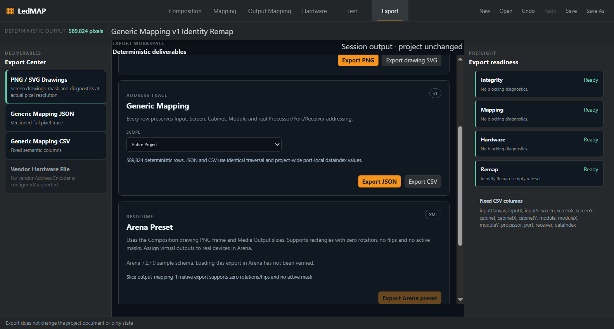
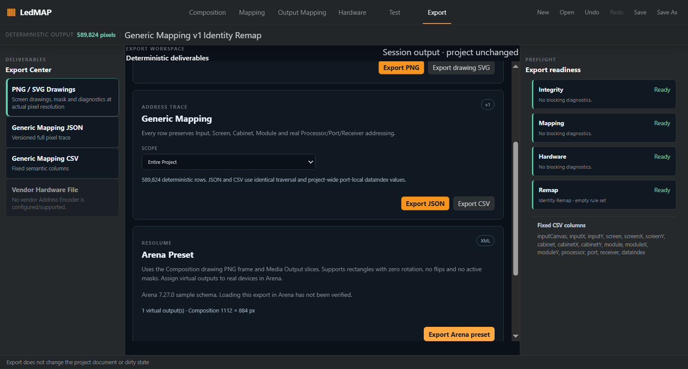

# P0-3 — coordinate contract and Resolume native adapters

Implementation date: 2026-10-06. Stage continuation authorized by the user after the proposed review/merge of P0-2 and coordinate/Resolume stage. The [stage specification](../specs/LEDMAP-COORDINATE-RESOLUME-001.md) was recorded before production changes; ADR-030 records the boundary.

## Baseline and scope

PR [#17](https://github.com/SystemDesignInstall/ledmap/pull/17), including its invalid-geometry review corrective, was squash merged as `239f1296f6596d3077436d16e3b206f0e8afb4e2`. Mandatory preflight passed on current `origin/master`. A clean dedicated worktree/branch, `.worktrees/coordinate-resolume` / `feat/coordinate-resolume-contract`, was created from that commit. The original `feat/composition-calculation` WIP remains separate and untouched.

This stage adds core coordinate translations, app XML reading/writing, an explicitly bound project-import API and a separate Arena preset export card. Native import GUI, operator binding/preview and live Arena verification belong to the next product integration stage. No .ledmap schema, Cabinet Engine, Mapping Region, Hardware topology or signal-order change is introduced.

## Coordinate contract

Core exports safe-integer Screen rectangle ↔ Composition raster translations with an explicit signed exported frame origin. Raster pixels and rectangle-edge vertices use distinct half-open conventions. Missing placements, unsupported chart-to-pixel scale, unsafe sums and frame clipping are errors. The export control uses the same fit/fixed frame as Composition chart PNG; even an unmapped Screen outside a fixed frame blocks export.

Resolume InputRect refers to that Composition drawing loaded as content. It is not an inferred Input Canvas/Mapping Region coordinate. Resolume OutputRect refers to a Media Output raster. One Media Output becomes one virtual Arena Screen; its ordered Output Mappings become slices. Existing rotation/flip inverse tests exercise quarter turns and independent flips without changing those engines.

## App adapters and atomic application

The reader uses exact app-only `@xmldom/xmldom@0.9.12`. Core remains free of runtime dependencies and XML/I/O. Native `ScreenSetup` preferences and `XmlState` presets retain names, IDs, version, known dimensions, ordered corners and warp controls. Unknown device dimensions stay null. Unsupported quads, sources, orientation, flip, masks/parameters, SoftEdging and changed lattice/homography are diagnosed and rejected for application/export; no bounding-box flattening is performed.

`applyResolumeOutputImport` requires an explicit exported Composition frame and one existing LedMAP Screen binding per source slice. Unknown output dimensions require explicit overrides. Independent disabled Arena Screen state cannot be represented by current MediaOutput intent, so project application rejects it; inspection/native DTO export retains it. Disabled slices are supported. Successful import appends only Media Outputs and Output Mappings and fits one document transaction, save/load and undo/redo. Failed input leaves the source project and history unchanged.

The writer emits deterministic LF UTF-8 `XmlState`, virtual outputs, ordered rectangle vertices and a 4×4 identity Warper/Homography. It refuses unsupported transforms, missing/ambiguous order, clipping and missing raster sizes. It writes a user-selected file through existing export IPC, never Arena preferences or guessed real-device hashes. Existing LedMAP reference XML/CSV remain available. Removing native adapters requires no project migration.

## Fixture provenance and compatibility

The [source audit](../licenses/external-source-audit.md#p0-3-actual-transfers) records full repository commits, file blobs, source/destination paths, TAKE/ADAPT/REIMPLEMENT IDEA methods, modifications and tests. Complete Stoatworks Labs and xmldom MIT notices are retained and hash checked. No B.L.I.N.K implementation, asset, dataset or UI expression is transferred.

| Fixture | Evidence |
|---|---|
| arena-preset.xml | Actual Arena 7.27.0 revision 14395 preset from pinned UnMapper; identifying names/IDs sanitized, geometry retained |
| arena-preferences.xml | Actual preferences, capture raster unknown; source edges exceed declared Composition and remain visible in inspection; SoftEdging blocks application |
| pixel-peeker-generated.xml | Independent writer output, eleven slices; not labelled Arena-produced |
| warp-synthetic.xml | Explicit synthetic bowed-lattice fixture; not real warped Arena evidence |
| ledmap-native-golden.xml | LedMAP-authored deterministic two-slice golden; exact translated source edges, escaped names and disabled slice |

[Fixture README](../../packages/app/test/fixtures/resolume/README.md) records exact sanitization. XML fixtures are pinned to LF by `.gitattributes` so snapshots survive Windows checkout.

Fixture parsing and deterministic read/write/project round trips have been checked. **The generated LedMAP preset has not been loaded in Arena. No Arena version is live verified.** Both the card and completed export message state this limitation. Native import GUI is not implemented in this stage.

## Security and final review

Input is limited to 2 MiB UTF-8 and 50,000 markup opening markers before DOM construction. DTD/entity declarations are rejected before parsing; all parser warnings/errors abort. After bounded construction, an iterative walk limits elements to 25,000, depth to 64 and attributes to 64 per element. Strict finite decimal values, positive dimensions, duplicate identities and structural ambiguities are checked. Output is limited to 250 total Screens/slices and 2 MiB. No XML resource resolution or network path is added.

Final self-review found that setup parameters, SoftEdging and unfamiliar nested parameter/Homography elements could otherwise be discarded. They now produce blocking diagnostics, with four added regressions. Stored warp geometry is rechecked by the writer even if a caller removes inspection diagnostics. Inputs are not frozen or mutated by project export/import planning.

## Verification

All local gates passed after the unsupported-XML metadata corrective. PR CI must verify the exact published head before ready-for-review.

| Gate | Evidence |
|---|---|
| Unit/regression tests | 109 files / 1719 tests passed, including 50 added coordinate/native cases |
| New coordinate/native cases | 50 cases passed including final metadata regressions |
| REF-001–004 and v3–v5 serialization | Covered by full unchanged acceptance suite |
| Typecheck / lint / build | Passed for both workspaces |
| License gate | 257 lockfile entries; both complete MIT notices hash checked |
| Full and production lockfile audit | 0 vulnerabilities on 2026-10-06 |
| Electron smoke | Passed, Electron 44.4.5 / embedded Node 24.21.0 on Windows |

Electron smoke exercises flip rejection, successful export, cancel, repeated identical output, preserved document/dirty state and parsing in Chromium's independent DOMParser. It verifies that native InputRect matches the actual Composition PNG frame. Screenshots below were visually inspected at 1583×849: compatibility text, readiness/error diagnostics and the action remain readable.

## Informational performance

Manual harness: [p03-resolume-benchmark.ts](fixtures/p03-resolume-benchmark.ts). Copy it to `packages/app/test/p03-resolume-benchmark.test.ts`, run the single file through `npm test`, then remove the temporary copy. It uses the existing REF-001 three-Screen fixture, one 800×600 Media Output/full-Screen slice, 10 warmups and 100 alternating paired runs, Node 24.19.0 on this Windows machine. No timing gate or release-scale claim is added.

| Environment | Value |
|---|---|
| OS | Windows 10 Pro 10.0.19045, 64-bit |
| CPU | Intel Core i7 M 620 @ 2.67 GHz |
| GPU | NVIDIA GeForce GT 330M; benchmark is CPU-only |
| RAM | 3.86 GiB reported physical memory |
| Runtime | Node 24.19.0 / Vitest 5.0.1 |
| Mode | Vitest source execution; bundle-size evidence uses production electron-vite build |
| Revision | Baseline `239f1296f6596d3077436d16e3b206f0e8afb4e2` plus the P0-3 feature diff; the publishing commit contains this report and the measured code |

Idle measurement after the final metadata corrective:

| Operation | Before p50 / p95 | After p50 / p95 | Delta p50 / p95 |
|---|---:|---:|---:|
| Existing reference XML versus native preparation + writing | 0.033 / 0.056 ms | 0.894 / 1.659 ms | +0.861 / +1.603 ms |
| Read actual 7179-byte Arena preset, three slices | n/a | 2.818 / 4.903 ms | n/a |

The export comparison uses different formats/features: the old 426-byte LedMAP reference XML remains unchanged; the 3348-byte native preset adds geometry readiness validation, native parameter blocks and identity warp data. It is not a throughput comparison of interchangeable implementations. These small fixtures do not establish responsiveness at maximum project size or live Arena interoperability.

Renderer build size: 648.60 → 664.39 kB, +15.79 kB uncompressed. Main bundle 225.21 kB and CSS 28.35 kB are unchanged. The native export plan is cached by immutable project identity and exported frame, avoiding repeated validation for unchanged UI state. The parser/project-import API is not connected to the renderer in this stage.

## Risks, rollback and next stage

Virtual output assignment and generated-file loading still need an operator check in Arena. The supported subset deliberately rejects effect/warp semantics that current LedMAP intent cannot represent; it does not promise a lossless arbitrary Arena preferences editor. Root distribution license and complete release attribution remain separate release decisions recorded by the existing dependency gate.

Rollback: revert the P0-3 integration commit (or squash commit after merge), run `npm ci`, and rebuild. The app-only XML dependency is removed with that revert; existing saved .ledmap data need no migration. Before the next production stage, review/merge this feature PR and start again from current `origin/master`.

P1 follows with native import inspection/binding/preview GUI and an operator-run Arena compatibility record. Hardware/device inference, vendor output SDKs, power and NDI remain separate authorized contracts.

## Publication status

All implementation and local verification are complete. The earlier commit attempt was rejected because continuation alone was not accepted as explicit authorization under `AGENTS.md`. The user subsequently instructed execution in order of the enumerated commit/PR, CI/review/merge, Arena verification and P1 steps. Commit and PR publication are now authorized; the published head must pass CI before review/merge. Live Arena verification remains a separate recorded result.
