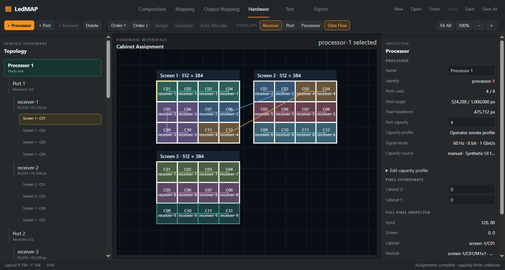
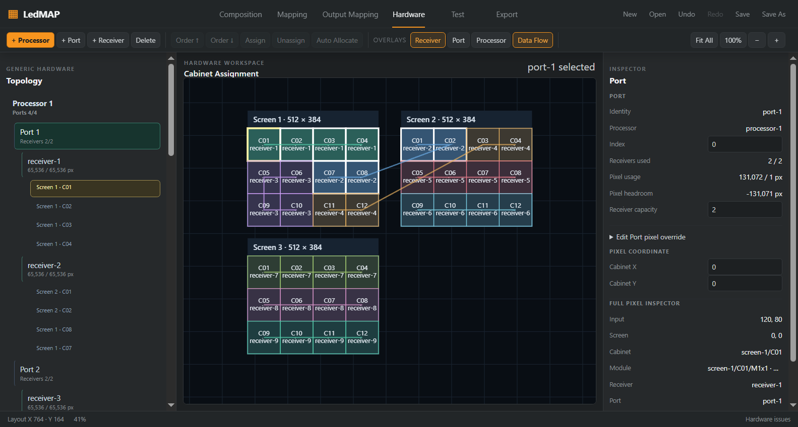

# P1-2 — профили транспортной ёмкости оборудования

Дата: 2026-10-06. База: `b6a0278526347ed56d525451bb167b9270db9b0f` (merged PR #19). Ветка: `feat/hardware-capacity-profiles`, отдельный worktree. План этапа одобрен пользователем и записан до production-кода: [спецификация](../specs/LEDMAP-HARDWARE-CAPACITY-PROFILES-001.md). Решение: ADR-032 в [DECISIONS](../DECISIONS.md).

## Что реализовано

- Processor хранит снимок профиля: название, происхождение и редакцию, точный режим Hz / bit depth / Gbit/s, необязательные пиксельные пределы Port и Processor. Отсутствующий предел остаётся unknown.
- Port может хранить ручной предел с причиной и собственным режимом. Он действует только при точном совпадении режима Processor. Смена или удаление профиля сохраняет override как неактивное намерение с предупреждением.
- Pure core рассчитывает фактические used / capacity / headroom по Cabinet → Receiver → Port → Processor. Отрицательный headroom сохраняет назначения и выдаёт отдельные ошибки перегрузки Port и Processor.
- Auto Allocate проверяет итоговую накопленную нагрузку всех трёх уровней, назначает целые кабинеты, сохраняет ручные цепочки и locks. Настроенный профиль с неизвестным необходимым пределом исключается из новых автоматических назначений. Старые проекты без профиля сохраняют прежнюю стратегию с предупреждением unknown.
- Ручное назначение и перенос проверяют окончательную нагрузку, включая освобождённое место. Увеличение известной перегрузки отклоняется целиком; уменьшение существующей перегрузки допускается.
- Hardware Inspector редактирует профиль и override явной командой Apply. Ошибка одного поля отклоняет весь патч. Один успешный Apply — один Undo. Показаны режим, источник, used / max / headroom и состояние override.
- Известная перегрузка транспорта блокирует Generic Mapping CSV / JSON preflight. Проверяется весь проект, поскольку несколько экранов могут использовать общий Port / Processor. Геометрические экспорты и Resolume сохраняют свой отдельный контракт.
- JSON v6 сохраняет только намерение; нагрузки, диагностика и результаты планирования пересчитываются. Save/Open, история, autosave и recovery поддерживают новые поля.

Cabinet Engine, Mapping Region, физические позиции и логическая нумерация сохраняют канонические границы. Core не получает runtime-зависимостей или I/O. Вендорный каталог, формула пропускной способности и интерполяция режимов в этот этап не входят.

## Совместимость и миграция

| Сценарий | Результат |
|---|---|
| Открытие старого v1–v5 | Поддерживается существующим dispatcher |
| Сохранение без профиля и override | Прежний v5 |
| Сохранение с новым намерением | v6 |
| Старый файл получает профиль | Диалог обновления формата / Save As / Cancel |
| Прямая запись нового намерения старым v3–v5 writer | Отказ вместо тихой потери полей |
| Неактивный override | Сохраняется в v6, не влияет на расчёт |
| Изменение проекта во время Save I/O | sourceSchemaVersion относится к действительно записанному snapshot |
| Открытие v6 старым LedMAP | Отказ как unsupported version |

Recovery manifest принимает v6 и сохраняет версию действительно записанного файла при reconciliation. Невалидный новый recovery payload не уничтожает предыдущую корректную запись.

## Проверки

Все приведённые локальные проверки выполнены на финальном production-коде этапа. Публикация PR и CI для точного HEAD фиксируются в GitHub PR; этот документ не выдаёт локальный прогон за проверку GitHub.

| Команда | Результат |
|---|---|
| `npm.cmd test` | **1770 / 1770**, 113 файлов; REF-001–004 зелёные |
| `npm.cmd run typecheck` | Оба workspace — PASS |
| `npm.cmd run lint` | PASS |
| `npm.cmd run build` | PASS |
| `npm.cmd run test:smoke` | Windows Electron — PASS |
| `npm.cmd run check:licenses` | 257 locked entries, PASS; MIT notices сохранены |
| `npm.cmd audit --package-lock-only --audit-level=low` | 0 vulnerabilities |
| `npm.cmd audit --omit=dev --audit-level=low` | 0 vulnerabilities |

Добавлены 42 теста: core 16, serialization 17, app transactions 8, recovery 1. Они проверяют независимые уровни перегрузки, фактические нагрузки, cumulative allocation, locks, неизвестные пределы, режим override, immutable copy, атомарный отказ, Undo/Redo, Save/Open, concurrent Save, экспортный preflight, recovery и строгую схему.

Негативные случаи: нецелые/нулевые/опасно большие пределы, неверные enum и Hz, неизвестные поля, getters, некорректные manufacturer references, `__proto__` / `constructor` / `toString`. Последние выявили унаследованную проверку `key in fields`; схемы v3 и v5/v6 теперь проверяют собственные поля через `Object.hasOwn`. Getter не исполняется. Старый тест future version перенесён с 6 на 7; невалидный v6 по-прежнему отклоняется.

Electron smoke использует настоящие элементы формы и файл: невалидный bit depth оставляет документ неизменным; корректный Apply создаёт один шаг истории; Undo/Redo возвращают точные состояния; Port override в 1 px даёт отрицательный headroom и блокирует CSV/JSON; Undo возвращает профиль; Save записывает v6, Open восстанавливает тот же проект.

## Производительность

Среда: Windows 10 Pro 10.0.19045 x64, Intel Core i7 M620 @ 2.67 GHz, 3.86 GiB RAM, NVIDIA GT 330M. CLI Node 24.19.0, Vitest 5.0.1; smoke Electron 44.4.5 / embedded Node 24.21.0. Сборка electron-vite, значения ниже — размеры выведенных артефактов, не gzip.

| Размер | База PR #19 | P1-2 | Изменение |
|---|---:|---:|---:|
| Main JS | 225.21 kB | 233.62 kB | +8.41 kB |
| Initial renderer JS | 672.52 kB | 693.45 kB | +20.93 kB |
| Lazy Resolume chunk | 239.90 kB | 239.90 kB | 0 |

Отдельное измерение `selectProjectHardwareLoad`: REF-001, 12 кабинетов / 192 модуля, 10 warmups и 100 чередующихся пар, без других проверочных процессов. **Это сравнение одной реализации без профиля и с явным профилем, не сравнение старой и новой ревизии.**

| Load calculation | Без профиля | С профилем | Изменение |
|---|---:|---:|---:|
| p50 | 0.3637 ms | 0.3783 ms | +0.0146 ms |
| p95 | 0.9186 ms | 0.8272 ms | −0.0914 ms |

Разница p95 не доказывает ускорение; такой объём и длительность измерения чувствительны к шуму. [Исходник измерения](fixtures/p12-capacity-benchmark.ts) рассчитан на копирование в `packages/app/test/p12-capacity-benchmark.test.ts`, запуск `npm.cmd test -- packages/app/test/p12-capacity-benchmark.test.ts --reporter=verbose --silent=false` и удаление только этой временной копии. В production и постоянную тестовую выборку benchmark не включён.

Измерение не охватывает DOM / frame time, полный allocator/remap, Save I/O, максимальные проекты и heap. Большие проекты требуют следующего отдельного этапа профилирования.

## UX evidence

До этапа Inspector показывал только число Port / Receiver slots; пиксельные пределы Port / Processor были неизвестны. После этапа профиль и его пределы видны рядом с реальными нагрузками; перегрузка не удаляет кабельные цепочки.

Снимки 1583×849 из финального Windows Electron smoke визуально проверены. Полный источник доступен в title и форме редактирования; строка Inspector сокращается по ширине. Screencast не записывался.

## Источники и безопасность

Реализация и fixtures собственные, на канонических LedMAP APIs. Перенос внешнего кода / assets / hardware dataset: **None**. B.L.I.N.K copied: **NO**. Зависимости и lockfile не изменены. [Provenance register](../licenses/external-source-audit.md#p1-2-capacity-profile-provenance).

Первичный документ для определения границ утверждений: [NovaStar VX1000 Pro Specifications V1.2.0, pp. 11–12](https://oss.novastar.tech/uploads/2025/10/VX1000-Pro-All-in-One-Controller-Specifications-V1.2.0.pdf), просмотрено 2026-10-06. Документ использован для отказа от неподтверждённого распространения общего максимума на произвольный режим. Данные и иллюстрации не копировались. Синтетические тестовые пределы не являются vendor specifications.

Источник manufacturer — введённая оператором HTTPS-ссылка и редакция; он не удостоверяет правильность чисел или совместимость. Приложение не загружает ссылку и не добавляет сетевых запросов. Новый JSON контракт использует существующие ограничения parser / extensions, строгие поля и числовые проверки. Renderer выводит значения через textContent / DOM controls.

## Ограничения и следующие шаги

- Встроенный каталог подтверждённых режимов и подключение реального LED hardware отсутствуют.
- Неизвестные пределы остаются предупреждением; legacy allocation без профиля сохраняет прежнее поведение. Для использования явной ёмкости оператор должен задать соответствующие пределы.
- Экспорт полноценного отчёта проекта и профилирование больших проектов остаются следующими последовательными задачами; весь продуктовый P1 не объявляется завершённым.
- Live Arena проверка пропущена по прямому указанию пользователя; совместимость остаётся непроверенной.

## Rollback

Revert опубликованного этапа отдельным коммитом и rebuild, затем обычный PR / CI. Перед использованием старого приложения сохранить исходный v6. Для совместимой копии в новом приложении явно удалить все профили и overrides и выполнить Save As: такой проект записывается как v5. Старый writer не используется для принудительного downgrade. Это удаляет именно новое намерение только в отдельной копии; исходный v6 остаётся доступным.
