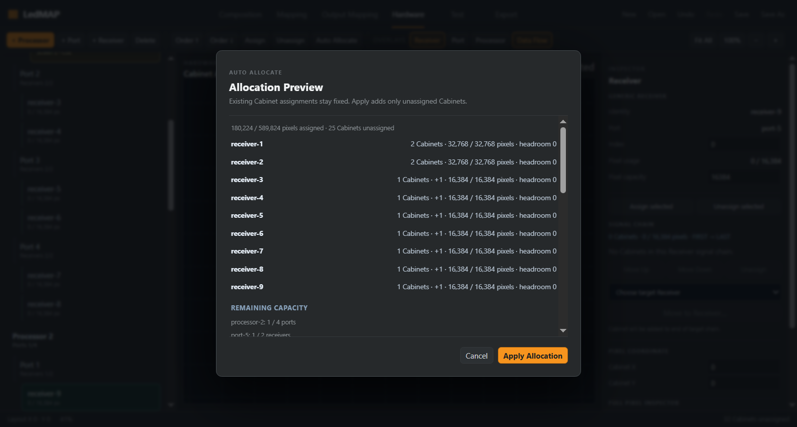
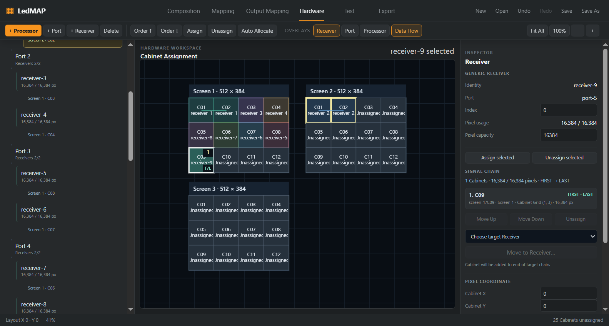

# P0-2 — project-bound Hardware planning and validation

Date: 2026-10-06. Authorized by the user's instruction to proceed after review/merge of dependency/license PR #16 and the proposed P0-2 stage. PR [#16](https://github.com/SystemDesignInstall/ledmap/pull/16) merged as `e991bca87946463689815fa4f0794ab4567026fb` after its head, green CI, reviews and open threads were checked.

Branch: `feat/project-wiring-capacity`. Dedicated worktree: `C:\Code\LedMap\.worktrees\project-wiring-capacity`. Mandatory preflight passed from current `origin/master` with clean status and `0 0` ahead/behind. The original Composition WIP is retained. Local Git excludes the service worktree directory.

## Implemented contract

[Specification](../specs/LEDMAP-PROJECT-HARDWARE-PLANNING-001.md); ADR-029 in [DECISIONS](../DECISIONS.md).

- Pure core selectors use real V2 Cabinet IDs and actual Receiver/Port/Processor membership. Cabinet logical traversal uses the existing Numbering, Direction and Snake transforms and never changes physical placement.
- `planProjectHardware` fills only unassigned Cabinets using whole-Cabinet first-fit in explicit Processor → Port → Receiver order. Existing assignment IDs, lock/origin metadata and route prefixes persist, including unlocked manual assignments.
- New auto intent is unlocked with origin=auto. Explicit reassignment promotes auto intent to manual/locked while preserving identity. Generated intent IDs handle collisions.
- Unpatched Cabinets are absent from assignments and routes. Existing overloaded assignments remain assigned and produce separate capacity diagnostics. Oversized Cabinets stay unpatched while later smaller Cabinets can fit.
- Loads use safe-integer Cabinet pixel dimensions and roll up through actual topology. Receiver pixel capacity, Port Receiver slots and Processor Port slots are distinct constraints. Headroom may be negative for an existing overload.
- `validateProject({ project })` uses the existing report/diagnostic contract for structural, Hardware, mapping geometry and supported Remap checks. Legacy validation and the original all-or-error allocator retain their behavior. Structural validation is extracted to keep imports acyclic.
- Hardware consumes core loads/report, shows partial allocation and unknown limits explicitly, rejects stale/tampered previews and applies a permitted partial plan as one undoable transaction. Cache keys are immutable snapshot identities.

## Capacity boundaries

Receiver capacity is the declared V2 pixelCapacity, not a vendor transport estimate. Unknown Receiver limits remain null, emit warnings and exclude new auto placement. Existing assignments to such Receivers are preserved.

V2 has no persistent per-Port/per-Processor transport pixel limit, vendor profile binding or signal-mode contract. These pixel capacities and headroom remain null; the UI states that transport limits are unknown. It does not infer NovaStar/Brompton packing, efficiency, bit depth or frame rate from a generic profile. A valid report means the implemented checks passed; it does not certify physical vendor compatibility.

## Compatibility and provenance

No project schema or migration changes. Existing v3–v5 load/save regression remains green. Only existing HardwareAssignment/SignalRoute intent persists; derived loads, unpatched sets and reports do not enter .ledmap files.

This stage uses canonical LedMAP model/engine/serializer code and fixtures. Candidate WIP wiring, capacity and diagnostics implementations are not imported. No external implementation, fixture, hardware dataset or B.L.I.N.K material is copied. The [source audit](../licenses/external-source-audit.md) records the scope.

## Verification

| Check | Result |
|---|---|
| `npm ci` | passed; lockfile unchanged |
| Full `npm test` with Windows symlink permission | 107 files, 1665 tests passed; 19 added |
| REF-001–004 | existing acceptance/regression tests passed |
| `npm run typecheck` | both workspaces passed |
| `npm run lint` | passed |
| `npm run build` | passed |
| `npm run check:licenses` | 256 lockfile entries; pinned MIT notice intact |
| `npm audit --package-lock-only --audit-level=low` | 0 vulnerabilities |
| `npm run test:smoke` | Electron 44.4.5, Node 24.21.0; passed |
| `git diff --check` | passed |

The first sandboxed full test run passed 1662 tests and failed three pre-existing symlink tests on Windows EPERM. The repeated full run with the required permission passed all 1665; the tests were not skipped or weakened.

Fault coverage includes insufficient capacity, mixed-size/oversized Cabinets, retained overload, unknown Receiver limits, missing orders, duplicate/unknown assignments, non-positional IDs, intent-ID collision and aggregate overflow. Integration coverage verifies stale/tampered preview rejection, manual route-prefix preservation, origin/lock round-trip, one history transaction and undo/redo.

Electron smoke reduces actual Receiver capacities in a three-Screen fixture. Preview reports 25 unassigned Cabinets without changing the document; Apply assigns the fitting Cabinets, retains both manual chains and leaves those 25 unassigned. Undo restores the original assignments. The same smoke continues through full allocation, pixel-exact PNG, byte-identical JSON/CSV and shared-Port address checks. GitHub CI for the submitted head is tracked on the integration PR.

## UX evidence

Preview with actual loads and a partial result:

Applied partial allocation with explicit unassigned Cabinets:

Both screenshots were inspected. The dialog has a scrolling body with visible summary and Apply/Cancel controls. No screencast was captured.

## Informational performance

Windows, Node 24.19.0; REF-001 (12 Cabinets, 192 Modules), 10 warm-up calls and 100 samples. Before is the existing all-or-error allocator with precomputed order; after is the new full V2 plan, including cloned intent and load projections. Their complete topology outputs are equal for this all-fitting fixture. Paired before/after sampling alternates order.

| Metric | Before | After | Delta |
|---|---:|---:|---:|
| Allocation proposal p50, ms | 0.702 | 1.050 | +0.348 |
| Allocation proposal p95, ms | 1.341 | 2.077 | +0.736 |
| New V2 report p95, ms | n/a | 2.761 | n/a |

The added planning/report scope costs time on this small fixture. These measurements are informational, do not include UI rendering, and make no claim about large-project p95, memory or frame rate. They are not a CI timing threshold.

The [benchmark harness](fixtures/p02-hardware-benchmark.ts) is retained outside automatic tests. To reproduce, copy it into `packages/app/test/p02-benchmark.test.ts`, run `npm test -- packages/app/test/p02-benchmark.test.ts --reporter=verbose --silent=false`, then remove that temporary copy. Do not overwrite an existing file at that path.

## Rollback and next work

Revert this stage's commit, or the squash SHA recorded on its integration PR after merge. Existing v3–v5 intent remains readable; no data migration is needed.

Per-Port/per-Processor vendor transport capacity requires a separately specified persistent profile/mode contract and primary manufacturer evidence. The next proposed P0-3 integration covers coordinate spaces and real Resolume interoperability fixtures. Native Arena compatibility is not established by this stage.
