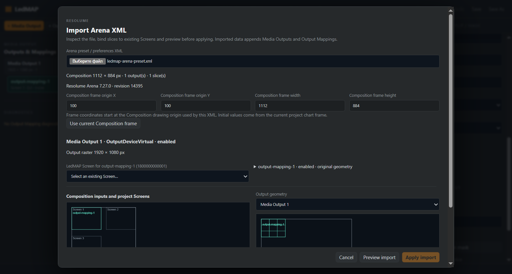
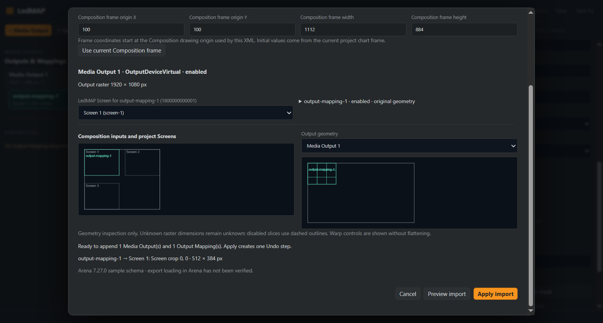
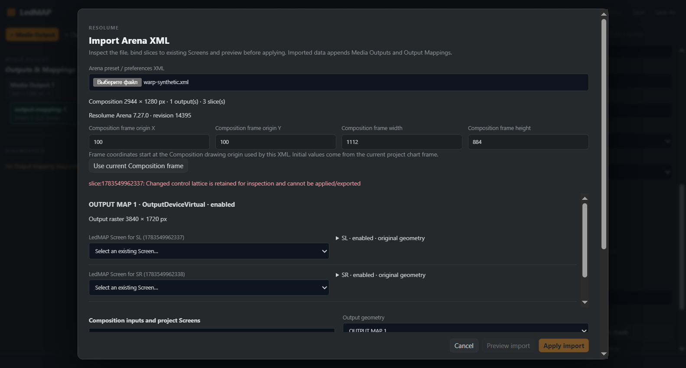

# P1-1 — native Resolume import UI

Date: 2026-10-06. Authorized scope: the user's instruction to execute the proposed commit/PR → CI/review/merge → Arena check → P1 import UI sequence. The user subsequently instructed **not to perform live Arena verification**; that step is skipped, compatibility remains unverified.

## Baseline and approval

P0-3 was published as [PR #18](https://github.com/SystemDesignInstall/ledmap/pull/18), feature commit `7db4ddfb8091aae52e734f48ed86f97239a2e944`. Exact-head [CI 37476292877](https://github.com/SystemDesignInstall/ledmap/actions/runs/37476292877) passed all gates including Linux Electron smoke. Self-review finished, there were no open review threads, and the PR was squash merged as `e25e5cc753a65267e3c009abc90f855495bc1a6b`.

P1 starts from that current `origin/master` in a clean dedicated worktree `.worktrees/resolume-import-ui` / branch `feat/resolume-import-ui`; mandatory preflight passed with no changes and 0/0 divergence. [LEDMAP-RESOLUME-IMPORT-UI-001](../specs/LEDMAP-RESOLUME-IMPORT-UI-001.md) was recorded before production changes. ADR-031 records the integration decisions. The original Composition WIP remains separate and untouched.

This closes only the narrow P1-1 inspection/binding/preview/application UI. It does not declare the full product P1 roadmap or arbitrary Arena preferences editing complete.

## Implemented flow

Output Mapping now offers Import Arena XML. The dialog reads only a selected local File, checks 2 MiB before reading and decodes strict UTF-8. Filename, declared version/Composition dimensions, outputs/raster sizes, original slice corners, enabled state, control lattice and unsupported diagnostics are inspected. Display is bounded to 250 screen/slice items and 250 diagnostics; source inspection retains the complete bounded DTO. Long display strings are shortened without altering source data.

Every slice starts with a blank existing-Screen binding. No name/geometry matching or Cabinet/Hardware inference occurs. The operator chooses explicit Composition frame origin/size, initially shown from the current project chart frame, and supplies missing output raster dimensions. Visualization bounds never supply missing dimensions. Overrides preserve source IDs such as `__proto__` as ordinary data keys.

Preview explicitly invokes the existing canonical P0-3 import adapter. It shows appended Media Outputs/mappings, resolved Screen-local crop coordinates, Composition quads over project Screen placements and selected output quads/control lattice. Canvas buffers are fixed at 720×240; lattice rendering is linear in controls. These drawings inspect geometry and do not render decoded media or attest Arena behavior. Disabled slices use dashed outlines; unsupported points remain visible and are refused for application.

The source project and history stay unchanged through file selection, inspection, settings and preview. Input edits or document identity/revision changes invalidate the prepared proposal. Apply recomputes canonical import and verifies that output intent matches the reviewed result, then appends it through one document transaction. Cancel/Escape, malformed input, wrong bindings, changed proposals and old file-read completions cannot apply data. Save/reopen and one-step Undo/Redo preserve imported intent.

## Architecture and compatibility

New app shared coordinator: `resolume-import-session.ts`; renderer/file/Canvas flow: `resolume-import-workspace.ts`. Output Mapping owns opening/deactivation and delegates one command. The app shell supplies document stamp and the existing chart frame. No new IPC, network, dependencies or schema. Core, Cabinet/Module identity, Mapping Regions, Hardware topology and signal order are unchanged. Source XML, bindings and preview/session data are not persisted; imported Media Output/Output Mapping intent uses existing v3–v5 fields.

The dialog/controller and XML parser load dynamically on first open. Leaving the workspace invalidates a pending load request. Late File reads are guarded against newer selections, closure and reopen. Names and diagnostics use textContent; no imported HTML or script is executed. Existing XML byte/markup/element/depth/attribute, DTD/entity, strict-number and warp limits apply.

Final self-review corrected global editor Canvas positioning leaking into the dialog, kept actions visible during scrolling, preserved the Canvas buffer's 3:1 aspect ratio across viewport widths, replaced a quadratic lattice column scan with a linear walk, limited displayed diagnostics/text and preserved special source ID raster overrides. The same external-source fixture/provenance and complete MIT notices from P0-3 remain intact. No new external code/asset/dataset/UI expression is transferred; B.L.I.N.K copied = NO.

## Verification

All local gates passed on the final implementation. Exact-head PR CI must pass before ready-for-review.

The first PR #19 [CI run 37482245379](https://github.com/SystemDesignInstall/ledmap/actions/runs/37482245379) passed tests, typecheck, lint, build, license and advisory gates, then timed out at the first import inspection in Linux smoke. The test selected a file through a hidden input before the dynamically loaded dialog installed its handlers and opened. Every test open now waits for the visible modal before choosing a file, preserving all import assertions and production loading behavior. The corrective also preserves the Canvas buffer aspect ratio and refreshes all three screenshots. A fresh exact-head CI run is required.

| Gate | Evidence |
|---|---|
| Full tests | 110 files / 1728 tests passed |
| New preview-session cases | 9 passed: exact crops, untouched preview, atomic one-step save/Undo/Redo, stale stamps, invalidation, copied settings, changed intent, malformed replacement, special raster keys, strict UTF-8/size |
| Core acceptance / persistence | Unchanged REF-001–004 and v3–v5 regression suite included |
| Typecheck / lint / build | Passed for both workspaces |
| License gate | 257 lockfile entries; both pinned MIT notices intact |
| Advisory audit, full / production | Zero findings on 2026-10-06; lock/dependencies unchanged |
| Electron smoke | Final flow passed, Electron 44.4.5 / embedded Node 24.21.0 on Windows, including special raster keys |

The retained full smoke uses the real file input/buttons. It tests blank/wrong/correct bindings, exact crop, bounded drawn Canvas, frame-edit invalidation, Cancel/Escape, unsupported synthetic warp, missing raster dimensions, invalid UTF-8, oversized/malformed files, late selection/closed-dialog races, successful append, unchanged non-output domains, one revision, Undo/Redo and save/reopen. No existing tests were skipped or weakened.

## Visual evidence

Screenshots were visually inspected at 1583×849. Header/file controls, frame fields, explicit binding selection and sticky actions are readable; the ready view shows geometry, crop and compatibility status. The modal scrolls for taller/multi-slice documents. Source labels/geometry are inspection data, not an Arena UI copy.

## Informational performance

Retained harness: [p11-resolume-import-benchmark.ts](fixtures/p11-resolume-import-benchmark.ts). Copy to `packages/app/test/p11-resolume-import-benchmark.test.ts`, run the single file with `npm test`, remove the temporary copy. Source: existing 6012-byte two-slice LedMAP native golden, existing REF-001 three-Screen project. Parse once outside timings; 10 warmups and 100 alternating paired samples. No other verification process was running during the measurement.

| Environment | Value |
|---|---|
| OS / CPU | Windows 10 Pro 10.0.19045 x64 / Intel Core i7 M 620 @ 2.67 GHz |
| GPU / RAM | NVIDIA GeForce GT 330M / 3.86 GiB reported physical RAM |
| Runtime / mode | Node 24.19.0, Vitest 5.0.1 source execution; CPU-only benchmark |
| Revision | Baseline `e25e5cc753a65267e3c009abc90f855495bc1a6b` plus this P1-1 feature diff |
| Build evidence | Production electron-vite, final sizes below |

| Scenario | Before | After | Delta |
|---|---:|---:|---:|
| Direct adapter application versus preview + checked application p50 | 1.167 ms | 2.448 ms | +1.281 ms |
| Same p95 | 2.030 ms | 4.220 ms | +2.190 ms |
| Renderer initial JS | 664.39 kB | 672.52 kB | +8.13 kB |
| Import/parser on-demand chunk | absent | 239.90 kB | new chunk, loaded on open |
| Main JS | 225.21 kB | 225.21 kB | 0 |
| CSS | 28.35 kB | 29.75 kB | +1.40 kB |

The adapter's algorithm is unchanged. The new after-scope runs both preview and fresh application validation, copying settings and comparing reviewed output intent; it is additional work rather than a regression of the same core operation. Timings exclude decoding, module load, DOM/Canvas, history/autosave and file I/O. Small-fixture measurements have no maximum-size, startup-latency or live Arena claim. The initial eager prototype produced a 908.35 kB startup bundle; dynamic loading keeps parser/dialog work outside initial loading.

## Risks, rollback and next work

Live Arena verification is skipped by user instruction and never relabelled verified. Independent disabled Arena Screen state, effects/masks/warps, unknown Composition dimensions and other unsupported intent still block project application. The frame must describe the content raster used by the source XML; operator binding/frame choices remain necessary. Broad P1 workflows and release-scale profiling are separate work.

Rollback: revert the P1-1 feature/integration commit and rebuild. No dependency change or migration is needed. Already imported Media Outputs/mappings remain standard project intent; removing the dialog does not discard them.

After local verification, publish this feature PR with exact-head CI. Review and merge precede further production work from current master. Live compatibility testing remains skipped until the user changes that instruction.
